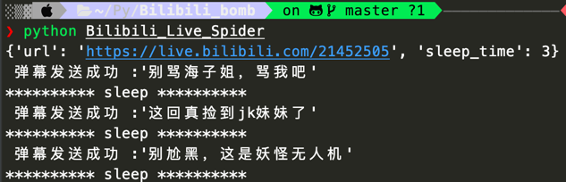
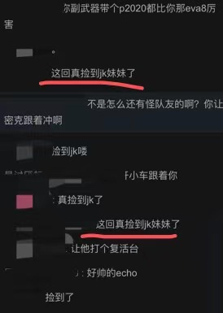

# Bilibili弹幕复读机

## 项目背景
B站直播的Web页发送弹幕具有时间限制，不能快速的发送弹幕（刷屏），在一些需要截屏抽奖的直播中很吃亏，通过爬虫的方式可以突破该限制，造成刷屏效果，增大中奖几率（不是。

本项目仅供娱乐目的，请勿用作商业！

## 项目实现功能

1. （伪）自动登陆B站直播（不需要自己去抓包找登陆cookie）
2. 指定直播间跟随发送弹幕（别人发什么我就发什么，复读机）
3. 频率控制（刷屏与否）

## 项目运行结果
测试机环境：Mac OS, M1 chip, Python 3.8

运行结果：

控制台：



实际发送弹幕结果：下面的“这回真捡到jk妹妹了就是复读的结果”




## 如何运行该项目

下载/克隆该仓库，进入该项目路径下。

安装所依赖插件（环境）：

```sh
pip3 install -r requirements.txt
```

安装完成后，执行以下命令启动程序，参数为直播间的url，：（需保证已经在浏览器端登陆了B站）

```sh
python Bilibili_Live_Spider https://live.bilibili.com/21452505
```

也可以不指定参数，通过修改config.json来控制爬取对象和频率，config.json内容如下：url为直播间的url，从浏览器地址栏复制即可，sleep_time为休眠时间，时间越小，弹幕发送越频繁。

```json
{
  "url": "https://live.bilibili.com/21452505",
  "sleep_time": 3
}
```

## 项目是如何实现的？
1. （伪）自动登陆B站直播
    通过`browsercookie`插件获取浏览器的所有cookie，然后找寻和B站直播相关的cookie，这样就无须抓包去找cookie了。
    但是需要保证浏览器端已经登陆了B站！

    如下程序为获取cookie：

    ```python
    # find cookie from browser
    cookies_jar = browsercookie.load()
    ```

    请求时使用如下格式使用上述cookie：

    ```python
    resp = requests.get(config['url'], cookies=cookies_jar, headers=headers).text
    ```

  

2. 指定直播间跟随发送弹幕

    url中的数字不一定为真实的直播间号，需要进行提取。

     ```python
     # get room_id, and set it into config
     get_room_id(config, cookies_jar)

     def get_room_id(config: dict, cookies_jar):
         # get room_id from url
         # each url have it's room_id
         # can't use last part of url as room_id
         headers = {
             'User-Agent': 'Mozilla/5.0 (Windows NT 6.1; WOW64) AppleWebKit/537.36 (KHTML, like Gecko) Chrome/55.0.2883.87 Safari/537.36',
             'refer': 'https://live.bilibili.com/'
         }

         resp = requests.get(config['url'], cookies=cookies_jar, headers=headers).text
         if re.search(r'room_id":(.*?),', resp):
             roomid_list = re.findall(r'room_id":(.*?),', resp)
             for iter in roomid_list:
                 if int(iter) != 0:
                     config['room_id'] = iter
                     break
         else:
             print("该直播间不存在或主播已经下播！")
             sys.exit(0)
         if not config.__contains__('room_id'):
             print("该直播间不存在或主播已经下播！")
             sys.exit(0)
     ```

   发送弹幕（需要先看看别人发了啥）：

   ```python
   while True:
     # get some barrages from the live
     barrages = get_barrage(config)
     # random choice a barrage
     send_msg = random.choice(barrages)
     # send it
     send_barrahe(config, cookies_jar, send_msg)
     # sleep some time
     print("{} sleep {}".format('*' * 10, '*' * 10))
     time.sleep(config['sleep_time'])
   ```

   

3. 频率控制

   通过设置休眠时间实现
   
   ```python
   time.sleep(config['sleep_time'])
   ```

